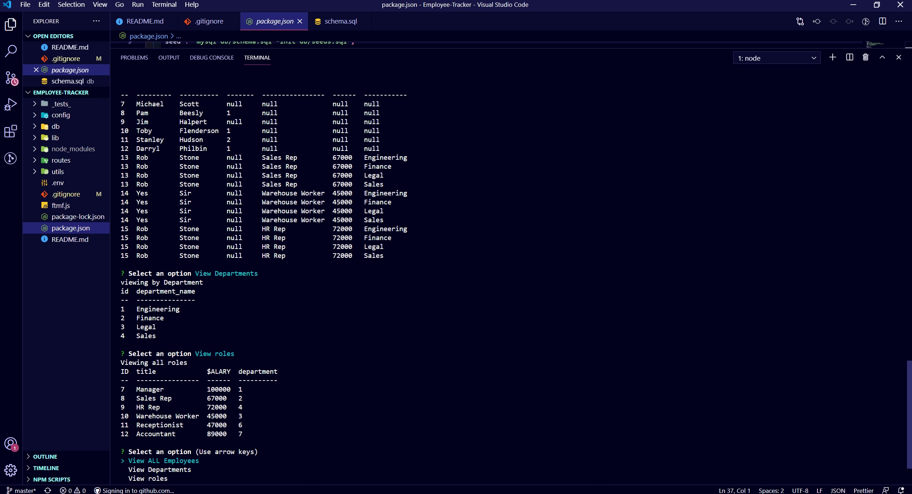

# Project Title : Employee-Tracker
## Project Description:
The application "Employee-Tracker" allows the user to run the ftms.js file in his/her terminal. The application allows the user to choose from options such as view employees, view roles, view departments, it also allows him/her to add, delete, or update the myql database. 
## Table of Contents
* [Installation](#installation)
* [Usage](#usage)
* [Contributing](#contributing)
* [Test](#test)
* [Questions](#questions)
* [License](#license)
* [Author] (#Author)
* [Badges](#badges)
## Installation
The user must clone the github repository. Then run npm install to install the 'node_modules' used. Then create the database on his/her local server named "employer". 
## Usage

![Video of Usage] (https://drive.google.com/file/d/1GLDuuwk20Th-eqRLXir4XKtiGGH6OZBr/view)
## Contributors
Jonathan C. Sanchez
## If you wish to contribute
N/A
## Questions
If you have any questions, contact J-sanchez on GitHub.
## License
GNU AGPLv3
## Test
n/a
### Contact Me
jonathan.sanchez@windstream.net
### Link to Github
https://github.com/J-sanchez
